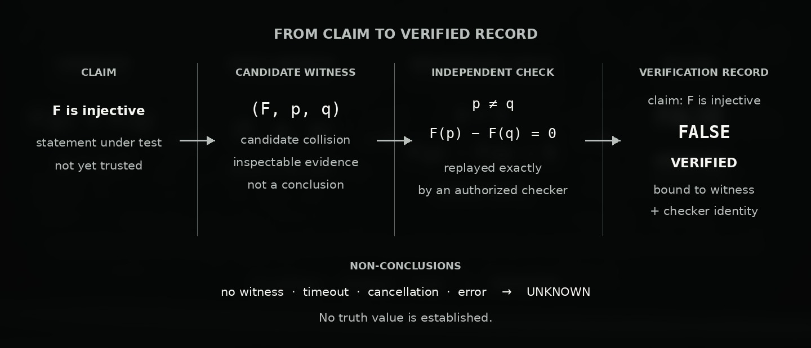

<p align="center">
  
</p>

<h1 align="center">Jacobian</h1>

<p align="center">
  <strong>Executable mathematics for agents. Evidence an independent checker can replay.</strong>
</p>

<p align="center">
  An MCP server, CLI, and Python library for conjectures, counterexamples,
  exact computation, and formal proof.
</p>

<p align="center">
  <a href="https://github.com/morluto/jacobian/actions/workflows/ci.yml"></a>
  <a href="https://pypi.org/project/jacobian/"></a>
  <a href="https://www.npmjs.com/package/jacobian"></a>
  <a href="https://pypi.org/project/jacobian/"></a>
  <a href="LICENSE"></a>
</p>

<p align="center">
  <a href="#quickstart">Quickstart</a> ·
  <a href="#how-verification-works">Verification</a> ·
  <a href="#capabilities">Capabilities</a> ·
  <a href="#documentation">Documentation</a> ·
  <a href="#contributing">Contributing</a>
</p>

Jacobian gives AI agents small, composable mathematical operations rather than
one opaque solver. An agent can construct an object, compute an invariant,
search for a witness, and submit exact evidence to a separate checker. Every
step remains visible as a typed result or artifact.

The trust boundary is deliberate: a search result, solver status, model answer,
timeout, or score is never promoted directly to `VERIFIED`. Only an
operator-authorized checker may emit a verified record, bound to the exact
claim, candidate, scope, semantics, certificate format, and checker identity.

## Quickstart

The npm launcher installs Jacobian and configures supported MCP clients:

```sh
npm install -g jacobian
jacobian setup
jacobian doctor
```

The launcher supports Claude, Codex, Cursor, Gemini, and OpenCode. It requires
Node.js 18 or newer, Python 3.12, and
[`uv`](https://docs.astral.sh/uv/). Run `jacobian mcp` to start the server
directly.

<details>
<summary><strong>Install from source</strong></summary>

```sh
git clone https://github.com/morluto/jacobian.git
cd jacobian
uv sync --dev
uv run jacobian --state-dir .jacobian init
```

Use `uv run jacobian --help` to inspect the CLI or `uv run jacobian-mcp` to
start the MCP adapter.

</details>

## How verification works

Jacobian separates finding evidence from deciding what that evidence proves.
Suppose an agent is testing the claim **“`F` is injective.”**

<p align="center">
  
</p>

**Claim → candidate witness → independent check → verification record**

| Stage | Output | What it establishes |
| --- | --- | --- |
| Claim | `F` is injective | The statement to investigate; not yet trusted |
| Search | A candidate witness `(F, p, q)` | Inspectable evidence, not a conclusion |
| Independent check | Confirm `p ≠ q` and `F(p) − F(q) = 0` exactly | The candidate is a genuine collision |
| Record | Bind the checked collision to the original claim and checker identity | The injectivity claim is `FALSE · VERIFIED` |

> **No witness is not proof.** A failed search, timeout, cancellation, or error
> leaves the claim `UNKNOWN`.

In the introductory tutorial, the same boundary appears as:

```text
evaluate.batch   →  FALSE  · HEURISTIC
witness.find     →  exact witness artifact
witness.verify   →  FALSE  · VERIFIED
```

`FALSE · HEURISTIC` is an evaluation. `FALSE · VERIFIED` is a conclusion
backed by independently checked evidence. Follow
[Find and verify a counterexample](docs/tutorials/first-verified-result.md)
for a runnable example.

## Capabilities

Capabilities are discovered at runtime through `capability://catalog`,
described with `capability.describe`, and executed with
`capability.invoke`. The installed catalog is the source of truth because
availability can depend on local backends.

| Domain | Agent-visible outcomes |
| --- | --- |
| Polynomial maps | Evaluate maps, compute Jacobians, search for collisions, independently verify collisions |
| Polynomial algebra | Normalize typed expressions, factor univariate polynomials, verify identities, verify exact system solutions |
| Exact linear algebra | Compute determinants, rank, kernels, and integer row Hermite normal forms; find and independently verify rational solutions or inconsistency certificates for `Ax = b` |
| Graphs | Construct and inspect graphs, enumerate paths, realize degree sequences, test isomorphism, search colorings |
| SAT and SMT | Find models or proof artifacts; independently replay assignments, DRAT proofs, and Alethe proofs |
| Universal algebra | Evaluate finite magma laws and search for countermodels |
| Polytopes | Compute convex combinations and linear separations |
| Lean | Discover declarations, retrieve premises, inspect proof states, and check proofs in pinned environments |
| Research memory | Store revisioned scratch work, findings, attempts, focus, and dependency-linked context |

See the [tool reference](docs/reference/tools.md) for the public surface and
the [atomic capability portfolio](docs/contributing/atomic-capability-portfolio.md)
for portfolio design and evaluation gates.

## Design

Jacobian keeps four responsibilities separate:

- **Agents own strategy.** The kernel supplies mathematical operations, not a
  prescribed research workflow.
- **Capabilities expose one coherent outcome.** Useful intermediate objects,
  failures, and proof obligations remain visible.
- **Artifacts carry context.** Results report execution status, provenance,
  scope, completeness, exactness, assurance, and available certificates.
- **Checkers own trust.** Plugins and search code cannot authorize a checker or
  change verification policy.

The public MCP surface stays small: the capability catalog plus
`capability.describe`, `capability.invoke`, and three direct workspace tools.
`workspace.open`, `workspace.write`, and `workspace.query` manage durable
agent-authored state; workspace entries remain `UNVERIFIED`.

## Documentation

| Start here | When you need detail |
| --- | --- |
| [Documentation home](docs/index.md) | Tutorials, how-to guides, reference, and explanation |
| [Architecture](docs/explanation/architecture.md) | System shape and the independent verification boundary |
| [Product model](docs/explanation/product-blueprint.md) | Capability contracts, ownership, artifacts, and assurance |
| [Product goals](docs/explanation/goals.md) | Active priorities and research direction |
| [Tool surface](docs/reference/tools.md) | MCP resources, tools, and invocation contracts |
| [Provider runtime](docs/reference/provider-runtime.md) | Backend availability, compatibility, and identity |
| [v0.2 specification](docs/reference/specifications/v0.2.md) | Supported release behavior and conformance |
| [Testing strategy](docs/reference/testing-strategy.md) | Validation layers, commands, and CI responsibilities |

Specialized contracts cover
[SAT artifacts](docs/reference/sat-artifacts.md),
[SMT/Alethe artifacts](docs/reference/smt-artifacts.md),
[exact rational linear-system evidence](docs/reference/linear-rational-solutions.md),
[integer matrix HNF](docs/reference/matrix-hermite-normal-form.md), and
[Lean declaration discovery](docs/reference/lean-declaration-discovery.md).
Architecture decisions are recorded in the
[ADR index](docs/explanation/adr/index.md).

## MCP clients and deployment

`jacobian setup` registers the local server with one or more supported clients.
The server advertises the capability entry points and direct workspace tools;
clients with MCP resource support can also read `capability://catalog`.

Remote clients can connect through Streamable HTTP or SSE with bearer-token
authentication and subject-bound tenant state. See
[Deploy the remote MCP server](docs/how-to/deploy-remote-mcp.md). Static tokens
are intended for controlled deployments, not as a hosted identity system.

## Optional backends

Some capabilities use backends that are not installed by default:

- CaDiCaL finds SAT models and UNSAT proof artifacts.
- cvc5 produces SMT UNSAT proofs; Carcara independently checks Alethe.
- The `flint` extra produces exact rational solution and inconsistency
  witnesses and integer row Hermite normal forms.
- Pinned Lean `CORE` and `MATHLIB` environments check formal certificates.

Backend availability is not verification authority. Provider output remains
unverified until the appropriate independent checker accepts its bound witness
or certificate.

<details>
<summary><strong>Lean certificates</strong></summary>

The `lean.check` capability binds an exact proposition and proof body to its
result. The bundled environments pin Lean, imports, and their allowed trust
bases; model-supplied imports and packages are rejected.

Prepare the pinned runtime with:

```sh
elan toolchain install leanprover/lean4:v4.31.0
cd lean
lake update
lake build
```

Proof-state interaction and premise retrieval are exploration aids. Their
output cannot become `VERIFIED` without a successful `lean.check`. See the
[guided declaration-discovery tutorial](docs/tutorials/lean-declaration-discovery.md).

</details>

<details>
<summary><strong>macOS and Z3</strong></summary>

The locked environment uses `z3-solver` 4.16.0.0. Its upstream macOS wheels
target macOS 15 or newer on Apple silicon and Intel. On an older release, `uv`
falls back to a source build that requires CMake, `make`, and a C++20 compiler.

Install the Xcode Command Line Tools and CMake before retrying `uv sync --dev`.
These commands report the relevant environment without changing it:

```sh
sw_vers -productVersion
uname -m
xcode-select -p
clang++ --version
cmake --version
make --version
```

See the
[`z3-solver` 4.16.0.0 files on PyPI](https://pypi.org/project/z3-solver/4.16.0.0/#files)
for the upstream wheel tags.

</details>

## Status

Jacobian is pre-stable. Experimental contracts may change between releases;
release specifications describe supported snapshots, not the order of ongoing
capability research.

The Python distribution contains the mathematical kernel, CLI, and MCP server.
The npm package is a thin launcher and MCP client installer for that same
implementation; it is not a separate JavaScript API.

<details>
<summary><strong>About the hero image</strong></summary>

The visual motif comes from the three-dimensional counterexample to the
Jacobian conjecture: an exact constant Jacobian determinant alongside three
distinct rational inputs with the same output. The equations are unusually
good shorthand for Jacobian's purpose—surprising candidates are valuable, but
exact computation and independent checking establish what can be trusted.

Terence Tao gives an
[accessible mathematical account](https://terrytao.wordpress.com/2026/07/21/a-digestion-of-the-jacobian-conjecture-counterexample/).
The determinant identity and collision have also been
[independently formalized in Isabelle/HOL](https://isa-afp.org/entries/Jacobian_Counterexample.html).
The two-dimensional conjecture remains open.

</details>

<details>
<summary><strong>Project boundaries</strong></summary>

Jacobian does not aim to put a universal mathematical ontology, a
natural-language-to-formal-mathematics translator, distributed search
infrastructure, or an opaque generic solver into the kernel. It does not
reimplement theorem provers or SAT/MIP solvers, accept arbitrary
model-supplied executable bundles, or treat floating-point scores, timeouts,
and solver labels as proofs.

</details>

## Contributing

Jacobian uses Python 3.12, `uv`, and a small `Makefile`:

```sh
make setup
make test-fast
make check
```

Read [CONTRIBUTING.md](CONTRIBUTING.md) before changing code. It documents
focused test commands, verification rules, documentation placement, and
pull-request expectations.

## License

[MIT](LICENSE)
